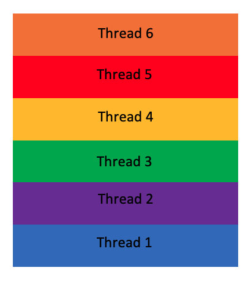
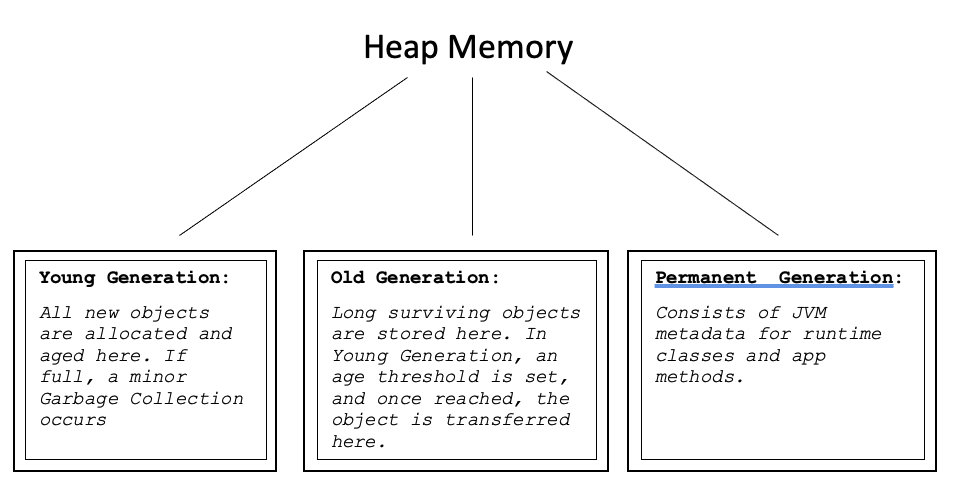

# Stack Memory vs. Heap Memory.
### What are each of them?

Lets begin with Stack Memory.

Stack Memory deals with Static Memory Allocation and the execution of threads. This static memory is primarily primitive values specific to a method, as well as references to objects stored in Heap Memory.

Access to such memory is defined as Last-In-First-Out or LIFO for short.

Imagine Stack Memory as a tower of blocks. Each block is the memory being used by a thread.

As you can see, the most recent memory block is on top of the tower - hence "Last-In".

As Threads are completed, the memory block is flushed out, and the space becomes ready and available. If the block is mid level, everything is moved down, so the next block can be on top.

As you can see, Thread 6 is 'First-Out', followed by Thread 4. All Threads above Thread 4 have moved down.

Because of the nature of Stack Memory, it's constantly growing and shrinking in size as threads are executed and terminated, respectively. This is due to Java's behaviour variables only exisitng as long as its method is running.

Compared to Heap Memory, Stack Memory is much faster to access due to its structured store of data.

If memory is full, Java will throw a *StackOverflowError*.

Another advantage of Stack Memory is that it is thread-safe, can be used and won't cause any errors if accessed by more than one thread simultanseously.

On the flip-side, Heap Memory deals with Dynamic Memory Allocation for ojbects and classes at run-time.
All new objects are created in Heap Space, and their reference counterparts are in Stack Memory. These objects are Global and can be acessed from anywhere in the application via complex memory management.

If the memory is full, Java will throw a *OutOfMemoryError*.

This memory model can be split into 3 smaller components, as shown below:

This memory is NOT automatically deallocated. it relies on Garbage Collection to free up unused objects.

Heap Memory isn't thread-safe either. This means state and behaviour errors may occur if accessed and used by more than one thread at a time. To combat this problem, this memory must be guarded by propeerly synchronizing the code.
